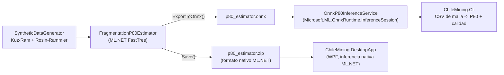

<div align="center">

# ⛏️ Chile Mining -- Control de Leyes y Calidad de Tronadura (.NET)

**Una solucion de ciencia de datos nativa en C# / ML.NET para estimacion de ley de cobre y calidad de fragmentacion de tronadura, construida y abierta directamente en Visual Studio**

🌐 **[English](README.md)** | **[Español](README.es.md)**

[](https://dotnet.microsoft.com/)
[](https://dotnet.microsoft.com/apps/ai/ml-dotnet)
[](https://onnxruntime.ai/)
[](https://learn.microsoft.com/dotnet/desktop/wpf/)
[](Dockerfile)
[](tests/ChileMining.Core.Tests/)
[](LICENSE)

</div>

---

## 1. Motivación

Construí esta herramienta pensando en el stack que realmente corre en el día a día de planificación minera: software de escritorio nativo en Windows. Buena parte de las herramientas con las que trabajan geólogos e ingenieros de planificación en faena (Vulcan, Datamine, Surpac, Deswik) son aplicaciones .NET, no notebooks ni dashboards web -- y en terreno, con conectividad limitada, un ejecutable que corre localmente sin depender de un servidor tiene más sentido que levantar un navegador.

Por eso este proyecto es C# de punta a punta -- generación de datos, entrenamiento y evaluación con ML.NET, y una app de escritorio WPF -- construido como una solución real de Visual Studio (`.sln` + 4 `.csproj`), no un script suelto. También es mi forma de ejercitar deliberadamente el lado .NET de mi trabajo en ciencia de datos: tipado fuerte y compilación estricta antes de tomar una decisión operacional (¿es mineral o estéril?, ¿hay que volver a tronar?) es la actitud que quiero en una herramienta que informa decisiones reales de faena.

## 2. Problema de negocio

Los equipos de planificación minera y geología toman constantemente dos decisiones durante el control de leyes y el diseño de tronadura:

1. **Control de leyes**: dadas las lecturas geoquímicas/geofísicas de un sondaje, ¿este material es mineral o estéril? El software geoestadístico manual suele ser lento de iterar en terreno.
2. **QA de diseño de tronadura**: dado el burden, espaciamiento, factor de potencia, dureza de roca y diámetro de perforación de una tronadura, ¿la fragmentación resultante será lo suficientemente fina para evitar re-tronaduras costosas o daño al chancador por sobre-tamaño?

Este proyecto construye tres modelos ML.NET -- una **regresión** para ley de cobre, un **clasificador multiclase** para un bucket de calidad de fragmentación, y una **regresión para P80** (el KPI continuo real de fragmentación, exportado a **ONNX** y servido de dos formas: nativamente vía ML.NET en la app de escritorio, y directamente vía **ONNX Runtime** en un CLI independiente) -- más una **app de escritorio WPF** nativa para uso interactivo, sin necesidad de navegador.

## 3. Estructura de la solución

```
chile-mining-grade-blast-quality-dotnet/
├── ChileMining.sln
├── src/
│   ├── ChileMining.Core/                  # libreria de clases: modelos de datos, generador, pipelines ML.NET
│   │   ├── Data/                          # DrillHoleSample, BlastDesign
│   │   ├── Generation/                    # SyntheticDataGenerator (Kuz-Ram / Rosin-Rammler P80)
│   │   └── Ml/                            # GradeEstimator, FragmentationClassifier,
│   │                                      # FragmentationP80Estimator, OnnxP80InferenceService
│   ├── ChileMining.Trainer/               # app de consola: generar -> entrenar -> evaluar -> guardar -> exportar ONNX
│   ├── ChileMining.Cli/                   # app de consola: CSV de mallas de tronadura -> predicciones P80 (ONNX Runtime)
│   └── ChileMining.DesktopApp/            # app WPF: asistente interactivo de leyes y tronadura
├── tests/
│   └── ChileMining.Core.Tests/            # xUnit: 16 tests
├── data/                                  # CSVs + modelos .zip/.onnx entrenados (generado, en .gitignore)
├── Dockerfile                             # build multi-etapa: Trainer + Cli, imagen runtime Linux
├── README.md
└── README.es.md
```

Abre `ChileMining.sln` directamente en Visual Studio -- la solución, referencias entre proyectos, y paquetes NuGet (`Microsoft.ML`, `Microsoft.ML.FastTree`, `Microsoft.ML.OnnxConverter`, `Microsoft.ML.OnnxRuntime`) ya están conectados y listos para compilar con F5.

## 4. Las tres tareas de ML

**Estimación de ley (regresión, FastTree)** -- predice la ley de cobre (%) desde `ProfundidadM`, `UnidadGeologica`, `TipoAlteracion`, `DensidadGrCm3`, `ResistividadOhmM`, `DistanciaFallaM`. El generador sintético liga la ley a la geología tal como zonan los depósitos porfídicos de cobre reales: los núcleos de alteración potásica en pórfido/skarn obtienen la mayor ley base, la andesita con alteración propilítica la menor, con densidad y resistividad correlacionadas a la ley mediante relaciones físicas plausibles (más sulfuros → roca más densa, menor resistividad) -- no ruido aleatorio independiente.

**Calidad de fragmentación (multiclase, SDCA)** -- predice un bucket `Fino` / `Medio` / `Grueso` / `SobreTamano` desde los parámetros de la malla. Se mantiene como el clasificador rápido original que usa la app de escritorio.

**P80 (regresión, FastTree, exportado a ONNX)** -- predice el KPI real y estándar de la industria de fragmentación: **P80**, el tamaño de malla de tamiz (cm) bajo el cual pasa el 80% de la masa fragmentada. Calculado en el generador sintético con el modelo real de **tamaño medio de fragmento de Kuznetsov + distribución Rosin-Rammler** (Cunningham, 1987) -- no un índice ad-hoc -- a partir de burden, espaciamiento, factor de potencia, dureza de roca, diámetro de perforación y altura de banco. `FragmentationQuality.Classify(p80)` bucketiza ese mismo valor continuo en las cuatro categorías de arriba, para que las etiquetas del clasificador y las predicciones del regresor nunca puedan discrepar en silencio sobre qué significa "Fino".

## 4.1 Por qué P80, y por qué ONNX Runtime específicamente

El clasificador categórico de arriba responde "esta tronadura probablemente sale fina o gruesa", pero el reporte de QA real de un ingeniero de planificación necesita el número: P80 en centímetros, comparado contra un objetivo. `FragmentationP80Estimator` entrena esa regresión, y luego `ExportToOnnx` serializa el pipeline completo (concatenación de features + normalización + FastTree) a un único archivo `.onnx`. `OnnxP80InferenceService` carga ese archivo con `Microsoft.ML.OnnxRuntime.InferenceSession` **directamente** -- no a través de `MLContext` -- que es el punto: un servicio de inferencia productivo, o un consumidor escrito en Python/C++/Java, no necesita el runtime de entrenamiento de ML.NET en absoluto, solo el archivo ONNX y algún binding de ONNX Runtime. `ChileMining.Cli` es exactamente ese consumidor.



## 5. Instalación

Requiere el [SDK de .NET 8](https://dotnet.microsoft.com/download) (o Visual Studio 2022+ con la carga de trabajo "Desarrollo de escritorio .NET", que ya lo incluye).

```powershell
git clone https://github.com/Rxyxs/chile-mining-grade-blast-quality-dotnet.git
cd chile-mining-grade-blast-quality-dotnet
dotnet restore
```

## 6. Uso

**1. Generar datos, entrenar y evaluar los tres modelos:**

```powershell
dotnet run --project src/ChileMining.Trainer
```

Escribe `drill_holes.csv`, `blast_designs.csv`, `grade_estimator.zip`, `fragmentation_classifier.zip`, `p80_estimator.zip` y `p80_estimator.onnx` en `data/`.

**2. Predecir P80 para un CSV de mallas de tronadura, vía ONNX Runtime:**

```powershell
dotnet run --project src/ChileMining.Cli -- --input mallas.csv --onnx data/p80_estimator.onnx --output resultado.csv
```

CSV de entrada (con encabezado requerido): `BurdenM,EspaciamientoM,FactorPotenciaKgTon,DurezaRocaMpa,DiametroPerforacionMm,AlturaBancoM`. Imprime una tabla de P80 + calidad por fila en consola y, con `--output`, escribe los mismos datos con dos columnas agregadas.

**3. Levantar la app de escritorio** (después de que el paso 1 haya corrido al menos una vez):

```powershell
dotnet run --project src/ChileMining.DesktopApp
```

Dos pestañas: **Control de Leyes** (ingresa parámetros de sondaje, obtén una ley estimada + clasificación mineral/estéril contra una ley de corte ilustrativa) y **Diseño de Tronadura** (ingresa parámetros de diseño de tronadura, obtén una categoría de fragmentación predicha).

**4. Correr los tests:**

```powershell
dotnet test
```

O abre `ChileMining.sln` en Visual Studio y usa Test Explorer / F5 directamente.

## 6.1 Docker

`Dockerfile` es un build de dos etapas (`dotnet/sdk:8.0` → `dotnet/runtime:8.0`) que publica solo `ChileMining.Trainer` y `ChileMining.Cli` -- `ChileMining.DesktopApp` es WPF (`net8.0-windows`) y queda deliberadamente excluida, ya que no puede correr en la imagen runtime Linux de todas formas. La imagen entrena y exporta el modelo ONNX una vez al construirse (`CHILEMINING_DATA_DIR=/app/data`), así que el contenedor queda utilizable de inmediato:

```powershell
docker build -t chilemining-cli .
docker run --rm -v ${PWD}:/data chilemining-cli --input /data/mallas.csv --onnx /app/data/p80_estimator.onnx --output /data/resultado.csv
```

**Nota honesta**: este Dockerfile se escribió y revisó cuidadosamente (imágenes base correctas, restore cacheado por capas, el override `CHILEMINING_DATA_DIR` para que el Trainer no necesite un checkout del `.sln` para encontrar su directorio de salida dentro del contenedor) pero no se ejecutó con un `docker build` real -- Docker no está instalado en la máquina donde se construyó este repositorio. Todo lo demás en este README (el build de .NET, los tests, la paridad de exportación/inferencia ONNX) *sí* se corrió y su salida real se capturó abajo; esta es la única pieza que no, y se marca explícitamente acá en vez de presentarse en silencio como verificada.

## 7. Resultados validados

Todos los números a continuación provienen de ejecutar realmente `ChileMining.Trainer` en este repositorio:

| Métrica | Valor |
|---|---|
| Muestras de sondaje generadas | 2.000 |
| Muestras de diseño de tronadura generadas | 2.000 |
| Estimador de ley -- R² | **0,833** |
| Estimador de ley -- RMSE | 0,121 (unidades de ley, es decir ±0,12 puntos porcentuales de Cu%) |
| Estimador de ley -- MAE | 0,096 |
| Clasificador de fragmentación -- MicroAccuracy | 0,865 |
| Clasificador de fragmentación -- MacroAccuracy | 0,852 |
| Clasificador de fragmentación -- LogLoss | 0,319 |
| **Estimador P80 -- R²** | **0,957** |
| Estimador P80 -- RMSE | 2,83 cm |
| Estimador P80 -- MAE | 2,20 cm |
| Tests xUnit | **16/16 pasando** |

Dos de los tests xUnit protegen específicamente contra una clase de bug clásica en machine learning: un clasificador cuya etiqueta en realidad no está correlacionada con sus features se ve bien hasta que revisas las métricas y encuentras un desempeño casi aleatorio. `PotasicaAlteration_HasHigherAverageGrade_ThanPropilitica` y `HigherPowderFactor_ProducesLowerP80_OnAverage` verifican la relación causal directamente contra el valor P80 continuo (no el bucket categórico, más robusto a la recalibración de umbrales -- ver §8 abajo), y `P80Estimator_TrainsWithReasonableFit` verifica que el regresor entrenado supere un umbral de R² de señal real, no solo "el código corre".

**Paridad de ONNX Runtime, medida directamente**: `OnnxExport_ProducesPredictionsMatchingMLNetWithinTolerance` corre los mismos 15 diseños de tronadura reservados a través del motor de predicción nativo de ML.NET y del modelo ONNX exportado vía `Microsoft.ML.OnnxRuntime.InferenceSession`, y verifica que concuerden con una tolerancia de 0,01 cm. En una corrida real: ML.NET predijo `67,29185` cm, ONNX Runtime predijo `67,29186` cm para la misma entrada -- redondeo de punto flotante, no una discrepancia de lógica, confirmando que la exportación es fiel y no solo que "el archivo se escribió".

## 8. Dos bugs reales detectados corriendo esto, no revisándolo

- **Umbrales de P80 mal calibrados.** La primera versión de `FragmentationQuality.Classify` usaba umbrales heredados del viejo índice de fragmentación ad-hoc (`Fino <= 15cm`). Una vez que P80 se calculó con el modelo real de Kuznetsov/Rosin-Rammler, el test existente `HigherPowderFactor_Produces...` empezó a fallar con "0,0% Fino vs 0,0% Fino" -- el mejor caso físicamente posible para los rangos de parámetros de este proyecto (factor de potencia máximo, roca más blanda, malla más cerrada) da P80 ≈ 19,9cm, por sobre el umbral anterior de 15cm, así que el bucket "Fino" era inalcanzable sin importar la entrada. Corregido generando 5.000 diseños y leyendo la distribución de percentiles de P80 real (min≈20cm, p50≈43cm, max≈98cm) antes de elegir los umbrales (30/45/60cm) -- calibrados contra la salida medida, no adivinados a priori.
- **Crash en la exportación ONNX por columnas de passthrough no relacionadas.** La primera implementación de `ExportToOnnx` pasaba el objeto `BlastDesign` completo (incluyendo el string `FragmentationLabel` y las columnas float `Label`/P80, sin uso en el pipeline de regresión) como el `IDataView` de muestra a `ConvertToOnnx`. El archivo `.onnx` resultante cargaba bien pero fallaba en cada llamada a `session.Run()` con `OrtValue::Get IsTensorSequence() was false` en un nodo `Identity` interno -- el exportador había modelado un passthrough para la columna string no usada de una forma que el runtime no podía ejecutar. Corregido recortando el sample view a solo las seis columnas de features numéricas (`SelectColumns`) antes de exportar; confirmado porque el test de paridad ONNX-vs-ML.NET de la §7 efectivamente pasó después, no solo porque la llamada de exportación no lanzó excepción.

## 9. Un bug de formato cultural que vale la pena conocer

Los escritores de CSV de `SyntheticDataGenerator` usan `FormattableString.Invariant(...)` en cada campo numérico. Sin esto, en una máquina con configuración regional en español (Chile), `$"{valor}"` formatea los floats con **coma** como separador decimal (`50,5`) -- lo que corrompe el CSV, ya que la coma también es el delimitador de columnas. Esto está cubierto por un test de regresión dedicado (`SaveDrillHolesToCsv_UsesInvariantCulture_RegardlessOfSystemCulture`) que cambia temporalmente `CurrentCulture` a `es-CL` y verifica que el archivo siga interpretándose como 7 columnas por fila. La app WPF toma el enfoque opuesto, deliberadamente, para *texto de cara al usuario*: parsea la entrada con `CurrentCulture` primero (para que un usuario chileno pueda escribir `0,30` de forma natural) y cae a `InvariantCulture` como respaldo (para que los valores por defecto del XAML, escritos con punto, sigan funcionando) -- el I/O de archivos quiere portabilidad, el texto de UI quiere coincidir con lo que el usuario realmente escribió.

## 10. Disclaimer

Todos los datos son sintéticos, generados por `SyntheticDataGenerator` con una semilla fija. La ley de corte usada en la app de escritorio (0,30% Cu) es ilustrativa, no una ley de corte económica real -- una ley de corte real depende de los costos de mina/planta y del precio del cobre, y no es una constante fija.

## Licencia

MIT -- ver [LICENSE](LICENSE).

## Autor

**Pablo Reyes** -- [github.com/Rxyxs](https://github.com/Rxyxs)
