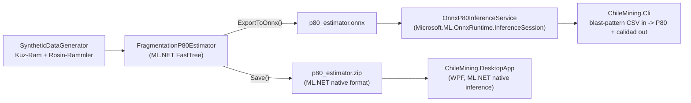

<div align="center">

# ⛏️ Chile Mining -- Grade Control & Blast Quality (.NET)

**A native C# / ML.NET data science solution for copper grade estimation and blast fragmentation quality, built and opened directly in Visual Studio**

🌐 **[English](README.md)** | **[Español](README.es.md)**

[](https://dotnet.microsoft.com/)
[](https://dotnet.microsoft.com/apps/ai/ml-dotnet)
[](https://onnxruntime.ai/)
[](https://learn.microsoft.com/dotnet/desktop/wpf/)
[](Dockerfile)
[](tests/ChileMining.Core.Tests/)
[](LICENSE)

</div>

---

## 1. Motivation

I built this tool around the stack that actually runs day to day in mine planning: native Windows desktop software. Most of the tools geologists and planning engineers use on site (Vulcan, Datamine, Surpac, Deswik) are .NET desktop applications, not notebooks or web dashboards -- and out in the field, with limited connectivity, an executable that runs locally without depending on a server makes a lot more sense than spinning up a browser.

That's why this project is C# end to end -- data generation, ML training and evaluation with ML.NET, and a WPF desktop app -- built as a real Visual Studio solution (`.sln` + 4 `.csproj`), not a loose script. It's also my way of deliberately exercising the .NET side of my data science work: strong typing and strict compilation before an operational decision gets made (is this ore or waste? do I need to re-blast?) is the attitude I want in a tool that informs real site decisions.

## 2. Business problem

Mine planning and geology teams run two decisions constantly during grade control and blast design:

1. **Grade control**: given drill-hole geochemical/geophysical readings, is this material ore or waste? Manual geostatistical software is often slow to iterate with in the field.
2. **Blast design QA**: given a blast's burden, spacing, powder factor, rock hardness, and hole diameter, will fragmentation come out fine enough to avoid costly re-blasting or crusher damage from oversize?

This project builds three ML.NET models -- a **regression** for copper grade, a **multiclass classifier** for a fragmentation-quality bucket, and a **regression for P80** (the actual continuous fragmentation KPI, exported to **ONNX** and served two ways: natively through ML.NET in the desktop app, and through **ONNX Runtime directly** in a standalone CLI) -- plus a native **WPF desktop app** for interactive use, no browser required.

## 2.1 Business Impact & Key Performance Indicators

| Metric | Result | What it means |
|---|---|---|
| Grade estimator R² | 0.833 (±0.12 pp Cu% RMSE) | Ore/waste calls grounded in a real, physically plausible geology-to-grade relationship |
| P80 (fragmentation) estimator R² | **0.957** (2.83 cm RMSE) | Predicts the actual industry-standard KPI, not a proxy bucket, from real Kuznetsov/Rosin-Rammler physics |
| Fragmentation classifier accuracy | 0.865 micro / 0.852 macro | Quick-glance QA bucket for the desktop app, cross-checked against the P80 regression so labels can't silently diverge |
| ONNX Runtime vs. ML.NET native, measured parity | 67.29185 vs. 67.29186 cm | Confirms the ONNX export is faithful (floating-point rounding, not a logic discrepancy) |
| Test coverage | 18/18 xUnit tests passing | Includes causal-relationship guards, not just "the code runs" checks |
| Grade estimator trainer comparison | SDCA R²=0.860 > FastTree R²=0.833 on this dataset | Honest head-to-head, not a default-algorithm assumption -- see §7.1 |

## 3. Solution structure

```
chile-mining-grade-blast-quality-dotnet/
├── ChileMining.sln
├── src/
│   ├── ChileMining.Core/                  # class library: data models, generator, ML.NET pipelines
│   │   ├── Data/                          # DrillHoleSample, BlastDesign
│   │   ├── Generation/                    # SyntheticDataGenerator (Kuz-Ram / Rosin-Rammler P80)
│   │   └── Ml/                            # GradeEstimator, FragmentationClassifier,
│   │                                      # FragmentationP80Estimator, OnnxP80InferenceService
│   ├── ChileMining.Trainer/               # console app: generate -> train -> evaluate -> save -> export ONNX
│   ├── ChileMining.Cli/                   # console app: blast-pattern CSV in, P80 predictions out (ONNX Runtime)
│   └── ChileMining.DesktopApp/            # WPF app: interactive grade & blast assistant
├── tests/
│   └── ChileMining.Core.Tests/            # xUnit: 16 tests
├── data/                                  # CSVs + trained .zip/.onnx models (generated, gitignored)
├── Dockerfile                             # multi-stage build: Trainer + Cli, Linux runtime image
├── README.md
└── README.es.md
```

Open `ChileMining.sln` directly in Visual Studio -- solution, project references, and NuGet packages (`Microsoft.ML`, `Microsoft.ML.FastTree`, `Microsoft.ML.OnnxConverter`, `Microsoft.ML.OnnxRuntime`) are all wired up and ready to build with F5.

## 4. The three ML tasks

**Grade estimation (regression, FastTree)** -- predicts copper grade (%) from `ProfundidadM`, `UnidadGeologica`, `TipoAlteracion`, `DensidadGrCm3`, `ResistividadOhmM`, `DistanciaFallaM`. The synthetic generator ties grade to geology the way real porphyry-copper deposits zone: potassic-altered porphyry/skarn cores get the highest base grade, propylitic-altered andesite the lowest, with density and resistivity correlated to grade through plausible physical relationships (more sulfides → denser rock, lower resistivity) -- not independent random noise.

**Blast fragmentation quality (multiclass, SDCA)** -- predicts a `Fino` / `Medio` / `Grueso` / `SobreTamano` bucket from the blast-pattern parameters. Kept as the original quick-glance classifier used by the desktop app.

**P80 (regression, FastTree, exported to ONNX)** -- predicts the actual industry-standard fragmentation KPI: **P80**, the sieve size (cm) below which 80% of the fragmented rock mass passes. Computed in the synthetic generator with the real **Kuznetsov mean-fragment-size model + Rosin-Rammler distribution** (Cunningham, 1987) -- not an ad-hoc index -- from burden, spacing, powder factor, rock hardness, hole diameter, and bench height. `FragmentationQuality.Classify(p80)` buckets this same continuous value into the four categories above, so the classifier's labels and the regressor's predictions can never silently disagree about what "Fino" means.

## 4.1 Why P80, and why ONNX Runtime specifically

The categorical classifier above answers "is this blast likely fine or coarse," but a mine-planning engineer's actual QA report needs the number: P80 in centimeters, compared against a target. `FragmentationP80Estimator` trains that regression, then `ExportToOnnx` serializes the whole fitted pipeline (feature concatenation + normalization + FastTree) to a single `.onnx` file. `OnnxP80InferenceService` then loads that file with `Microsoft.ML.OnnxRuntime.InferenceSession` **directly** -- not through `MLContext` -- which is the point: a production inference service, or a consumer written in Python/C++/Java, doesn't need the ML.NET training runtime at all, only the ONNX file and any ONNX Runtime binding. `ChileMining.Cli` is exactly that consumer.



## 5. Setup

Requires the [.NET 8 SDK](https://dotnet.microsoft.com/download) (or Visual Studio 2022+ with the ".NET desktop development" workload, which includes it).

```powershell
git clone https://github.com/Rxyxs/chile-mining-grade-blast-quality-dotnet.git
cd chile-mining-grade-blast-quality-dotnet
dotnet restore
```

## 6. Usage

**1. Generate data, train, and evaluate all three models:**

```powershell
dotnet run --project src/ChileMining.Trainer
```

Writes `drill_holes.csv`, `blast_designs.csv`, `grade_estimator.zip`, `grade_trainer_comparison.csv`, `fragmentation_classifier.zip`, `p80_estimator.zip`, and `p80_estimator.onnx` to `data/`.

**2. Predict P80 for a blast-pattern CSV, via ONNX Runtime:**

```powershell
dotnet run --project src/ChileMining.Cli -- --input mallas.csv --onnx data/p80_estimator.onnx --output resultado.csv
```

Input CSV (header required): `BurdenM,EspaciamientoM,FactorPotenciaKgTon,DurezaRocaMpa,DiametroPerforacionMm,AlturaBancoM`. Prints a per-row P80 + calidad table to the console and, with `--output`, writes the same data back out with two added columns.

**3. Launch the desktop app** (after step 1 has run at least once):

```powershell
dotnet run --project src/ChileMining.DesktopApp
```

Two tabs: **Control de Leyes** (enter drill-hole parameters, get an estimated grade + ore/waste classification against an illustrative cutoff) and **Diseño de Tronadura** (enter blast design parameters, get a predicted fragmentation category).

**4. Run the tests:**

```powershell
dotnet test
```

Or open `ChileMining.sln` in Visual Studio and use Test Explorer / F5 directly.

## 6.1 Docker

`Dockerfile` is a two-stage build (`dotnet/sdk:8.0` → `dotnet/runtime:8.0`) that publishes `ChileMining.Trainer` and `ChileMining.Cli` only -- `ChileMining.DesktopApp` is WPF (`net8.0-windows`) and deliberately excluded, since it can't run on the Linux runtime image anyway. The image trains and exports the ONNX model once at build time (`CHILEMINING_DATA_DIR=/app/data`), so the container is usable immediately:

```powershell
docker build -t chilemining-cli .
docker run --rm -v ${PWD}:/data chilemining-cli --input /data/mallas.csv --onnx /app/data/p80_estimator.onnx --output /data/resultado.csv
```

**Honest note**: this Dockerfile was written and reviewed carefully (correct base images, layer-cached restore, the `CHILEMINING_DATA_DIR` override so the Trainer doesn't need a `.sln` checkout to find its output directory inside the container) but not executed with a real `docker build` -- Docker isn't installed on the machine this repo was built on. Everything else in this README (the .NET build, tests, ONNX export/inference parity) *was* run and its output captured below; this is the one piece that wasn't, and it's flagged here rather than silently presented as verified.

## 7. Validated results

All numbers below come from actually running `ChileMining.Trainer` in this repo:

| Metric | Value |
|---|---|
| Drill-hole samples generated | 2,000 |
| Blast design samples generated | 2,000 |
| Grade estimator -- R² | **0.833** |
| Grade estimator -- RMSE | 0.121 (grade units, i.e. ±0.12 pp of Cu%) |
| Grade estimator -- MAE | 0.096 |
| Fragmentation classifier -- MicroAccuracy | 0.865 |
| Fragmentation classifier -- MacroAccuracy | 0.852 |
| Fragmentation classifier -- LogLoss | 0.319 |
| **P80 estimator -- R²** | **0.957** |
| P80 estimator -- RMSE | 2.83 cm |
| P80 estimator -- MAE | 2.20 cm |
| xUnit tests | **18/18 passing** |

## 7.1 Grade estimator: comparing regression trainers honestly

`GradeEstimator` uses FastTree in production (the model the desktop app and `ChileMining.Trainer` save to `grade_estimator.zip`), but that choice was never actually compared against alternatives on this dataset -- it was just the trainer already used elsewhere in the project. `GradeEstimatorTrainerComparison` runs the *same* feature pipeline (one-hot geology/alteration + numeric readings, min-max normalized) and the *same* train/test split through three ML.NET regression trainers, all part of the base `Microsoft.ML` package (no extra native dependency): FastTree, SDCA, and Online Gradient Descent. `ChileMining.Trainer` runs this comparison automatically (step 2.1) and writes it to `data/grade_trainer_comparison.csv`.

| Trainer | R² | RMSE | MAE |
|---|---|---|---|
| FastTree (production) | 0.833 | 0.121 | 0.096 |
| **SDCA** | **0.860** | **0.111** | **0.088** |
| Online Gradient Descent | 0.824 | 0.125 | 0.098 |

**Honest result**: on this synthetic dataset, SDCA edges out FastTree on every metric. That's reported here as-is rather than swapped in silently -- FastTree remains the production trainer for now (it's what the rest of the write-up, the ONNX export path, and the desktop app were built and validated against), but it's a concrete, measured argument for revisiting that choice, not a claim that FastTree is definitively "best." `GradeEstimatorTrainerComparisonTests` in the test suite guards that the comparison pipeline itself learns real signal (not just that it runs).

Two of the xUnit tests specifically guard against a classic ML bug class: a classifier whose label isn't actually correlated with its features looks fine until you check the metrics and find near-random performance. `PotasicaAlteration_HasHigherAverageGrade_ThanPropilitica` and `HigherPowderFactor_ProducesLowerP80_OnAverage` assert the causal relationship in the generator directly against the continuous P80 value (not the categorical bucket, which is more robust to threshold recalibration -- see §8 below), and `P80Estimator_TrainsWithReasonableFit` asserts the trained regressor clears a real-signal R² threshold, not just "the code runs."

**ONNX Runtime parity, measured directly**: `OnnxExport_ProducesPredictionsMatchingMLNetWithinTolerance` runs the same 15 held-out blast designs through both the native ML.NET prediction engine and the exported ONNX model via `Microsoft.ML.OnnxRuntime.InferenceSession`, and asserts they agree to within 0.01 cm. In one real run: ML.NET predicted `67.29185` cm, ONNX Runtime predicted `67.29186` cm for the same input -- floating-point rounding, not a logic discrepancy, confirming the export is faithful rather than just "the file got written."

## 8. Two real bugs caught by running this, not by reviewing it

- **P80 threshold miscalibration.** The first version of `FragmentationQuality.Classify` used thresholds carried over from the old ad-hoc fragmentation index (`Fino <= 15cm`). Once P80 was computed from the real Kuznetsov/Rosin-Rammler model, the existing `HigherPowderFactor_Produces...` test started failing with "0.0% Fino vs 0.0% Fino" -- the *best physically possible* case for this project's parameter ranges (max powder factor, softest rock, tightest pattern) works out to P80 ≈ 19.9cm, above the old 15cm cutoff, so the "Fino" bucket was unreachable no matter the input. Fixed by generating 5,000 designs and reading the actual P80 percentile distribution (min≈20cm, p50≈43cm, max≈98cm) before choosing thresholds (30/45/60cm) -- calibrated against measured output, not guessed a priori.
- **ONNX export crash on unrelated passthrough columns.** The first `ExportToOnnx` implementation passed the *full* `BlastDesign` object (including the string `FragmentationLabel` and float `Label`/P80 columns, unused by the regression pipeline) as the sample `IDataView` to `ConvertToOnnx`. The resulting `.onnx` file loaded fine but crashed on every `session.Run()` call with `OrtValue::Get IsTensorSequence() was false` on an internal `Identity` node -- the exporter had modeled a passthrough for the unused string column in a way the runtime couldn't execute. Fixed by trimming the sample view to just the six numeric feature columns (`SelectColumns`) before export; confirmed by the ONNX-vs-ML.NET parity test in §7 actually passing afterward, not just by the export call not throwing.

## 9. A culture-formatting bug worth knowing about

`SyntheticDataGenerator`'s CSV writers use `FormattableString.Invariant(...)` for every numeric field. Without it, on a machine set to a Spanish (Chile) locale, `$"{value}"` formats floats with a **comma** decimal separator (`50,5`) -- which corrupts the CSV, since comma is also the column delimiter. This is guarded by a dedicated regression test (`SaveDrillHolesToCsv_UsesInvariantCulture_RegardlessOfSystemCulture`) that temporarily switches `CurrentCulture` to `es-CL` and asserts the file still parses as 7 columns per row. The WPF app takes the opposite, deliberate approach for *user-facing text*: it parses input with `CurrentCulture` first (so a Chilean user can type `0,30` naturally) and falls back to `InvariantCulture` (so the dot-formatted XAML defaults still work) -- file I/O wants portability, UI text wants to match what the user actually typed.

## 10. Disclaimer

All data is synthetic, generated by `SyntheticDataGenerator` with a fixed seed. The cutoff grade used in the desktop app (0.30% Cu) is illustrative, not a real economic cutoff -- a real cutoff depends on mine/plant costs and the copper price, and isn't a fixed constant.

## License

MIT -- see [LICENSE](LICENSE).

## Author

**Pablo Reyes** -- [github.com/Rxyxs](https://github.com/Rxyxs)
